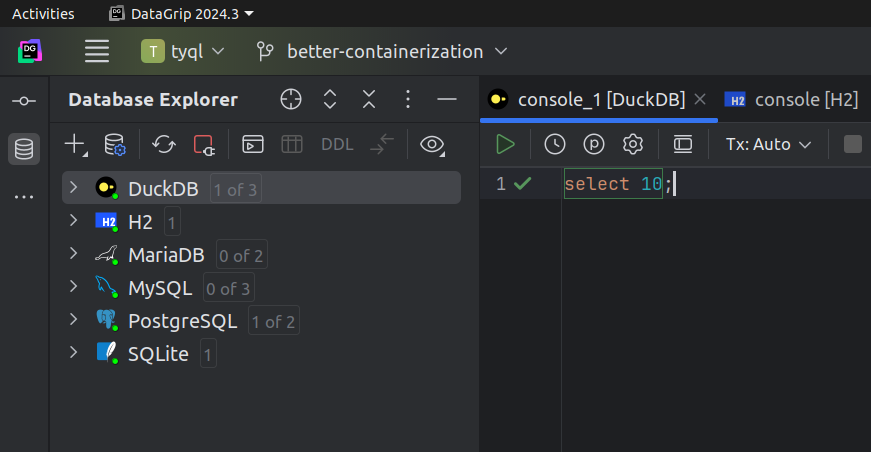

# Developer Documentation

## Current tooling problems
#### Missing Postgres driver (not urgent)
All works perfectly inside the containers. But when the DBs are up and I invoke `sbt run test` directly from my laptop, the first attempt to connect to Postgres ends with this:
```
==> X test.integration.booleans.BooleanTests.boolean encoding  0.014s java.sql.SQLException: No suitable driver found for jdbc:postgresql://localhost:5433/testdb
    at java.sql.DriverManager.getConnection(DriverManager.java:708)
    at java.sql.DriverManager.getConnection(DriverManager.java:230)
```

#### Containers break VSCode's integration (somewhat urgent)
When you use VSCode with Metals, there are directories `.metals`, `.bloop`, `project/.bloop` which are being used. Of them the bloop directories are also used by the containerized tests. So after you run test in docker, you have to close the VSCode,
```sh
rm -rf .metals .bloop project/.bloop
```
and then restart VSCode and click 'Import build' again in the Metals popup. This takes around 35 seconds.

This happens because the containers use the project directory, including its internal tooling directories via mounted volume and the IDE and Debian tests keep overwriting these settings.


## Running Tests
Tests are untagged by default or tagged as expensive.
```scala
import test.needsDBs
test("PostgreSQL responds".tag(needsDBs)) { ??? }
```

```bash
# Run all tests (both cheap and expensive)
sbt test
# Run only expensive tests
sbt "testOnly -- --include-tags=Expensive"
# Run only cheap tests
sbt "testOnly -- --exclude-tags=Expensive"
```

## Containerization

We provide a `dev.sh` script to manage the development environment using Docker Compose.
```bash
# Start all required databases
./dev.sh db-start
# Stop all databases
./dev.sh db-stop
# Run all tests
./dev.sh test
```
For convenience, bash completion is provided for the `dev.sh` script. To enable it:
```bash
# Add this to your ~/.bashrc or ~/.bash_profile
source /path/to/project/dev.sh.completion
```
After enabling completion, you can use Tab to autocomplete `dev.sh` commands:
```bash
./dev.sh <TAB>
# Shows: db-start db-stop test
```
Test results from Docker are automatically saved to the `test-results` directory with timestamps.

The containerized environment includes:
- PostgreSQL (port 5433)
- MySQL (port 3307)
- MariaDB (port 3308)
- SQLite, DuckDB, H2 (in-memory from the main container)

## DataGrip IDE

`.idea/dataSources.xml`
```xml
<?xml version="1.0" encoding="UTF-8"?>
<project version="4">
  <component name="DataSourceManagerImpl" format="xml" multifile-model="true">
    <data-source source="LOCAL" name="MySQL" uuid="bde9cebe-4020-4403-b1ae-239146adf173">
      <driver-ref>mysql.8</driver-ref>
      <synchronize>true</synchronize>
      <jdbc-driver>com.mysql.cj.jdbc.Driver</jdbc-driver>
      <jdbc-url>jdbc:mysql://localhost:3307</jdbc-url>
      <working-dir>$ProjectFileDir$</working-dir>
    </data-source>
    <data-source source="LOCAL" name="H2" uuid="f3206e46-5001-45cf-8f82-c19dd87be986">
      <driver-ref>h2.unified</driver-ref>
      <synchronize>true</synchronize>
      <jdbc-driver>org.h2.Driver</jdbc-driver>
      <jdbc-url>jdbc:h2:mem:default</jdbc-url>
      <working-dir>$ProjectFileDir$</working-dir>
    </data-source>
    <data-source source="LOCAL" name="PostgreSQL" uuid="aa9d8b89-8df1-4553-82d8-0bc941a7b2a7">
      <driver-ref>postgresql</driver-ref>
      <synchronize>true</synchronize>
      <jdbc-driver>org.postgresql.Driver</jdbc-driver>
      <jdbc-url>jdbc:postgresql://localhost:5433/testdb</jdbc-url>
      <working-dir>$ProjectFileDir$</working-dir>
    </data-source>
    <data-source source="LOCAL" name="MariaDB" uuid="8ca876f5-39b0-49b1-b268-d227ad8551d0">
      <driver-ref>mariadb</driver-ref>
      <synchronize>true</synchronize>
      <jdbc-driver>org.mariadb.jdbc.Driver</jdbc-driver>
      <jdbc-url>jdbc:mariadb://localhost:3308</jdbc-url>
      <working-dir>$ProjectFileDir$</working-dir>
    </data-source>
    <data-source source="LOCAL" name="SQLite" uuid="b72e2d11-735f-4790-874b-ac4d51466d9d">
      <driver-ref>sqlite.xerial</driver-ref>
      <synchronize>true</synchronize>
      <jdbc-driver>org.sqlite.JDBC</jdbc-driver>
      <jdbc-url>jdbc:sqlite::memory:</jdbc-url>
      <working-dir>$ProjectFileDir$</working-dir>
    </data-source>
    <data-source source="LOCAL" name="DuckDB" uuid="cf6e9070-94aa-428e-8e3d-fd901477c153">
      <driver-ref>duckdb</driver-ref>
      <synchronize>true</synchronize>
      <jdbc-driver>org.duckdb.DuckDBDriver</jdbc-driver>
      <jdbc-url>jdbc:duckdb:</jdbc-url>
      <working-dir>$ProjectFileDir$</working-dir>
    </data-source>
  </component>
</project>
```

SQLite, H2, DuckDB are in-memory, no auth. Postgres, MySQL, MariaDB are localhost testuser:testpass. Watch out for ports!
- PostgreSQL: 5433 (and not 5432)
- MySQL: 3307 (and not 3306)
- MariaDB: 3308 (and not 3306)

This is what a correctly configured DataGrip looks like:


## Windows 11 tooling

Paste the `prepare.ps1` script into a priviledged PowerShell session once, in a Windows 11 virtual machine.
Then run the tests from some public branch by invoking `download_and_sbt_test.ps1` from an unpriviledged PowerShell session.

For now there is no further automation, as we expect to test on Windows only just before the release.

`prepare.ps1`
```powershell
# Install Java 23
$url = "https://download.oracle.com/java/23/latest/jdk-23_windows-x64_bin.msi"
$output = "$env:TEMP\jdk-23_windows-x64_bin.msi"
Invoke-WebRequest -Uri $url -OutFile $output
Start-Process msiexec.exe -Wait -ArgumentList "/i $output /qn"
Remove-Item $output

# Install chocolatey
Set-ExecutionPolicy Bypass -Scope Process -Force; [System.Net.ServicePointManager]::SecurityProtocol = [System.Net.ServicePointManager]::SecurityProtocol -bor 3072; iex ((New-Object System.Net.WebClient).DownloadString('https://community.chocolatey.org/install.ps1'))

# Instal general dependencies
## This sometimes works and then you cannot find the executables in PATH, it's a known issue, I do not know what causes it
choco install -y sbt
```

`download_and_sbt_test.ps1`
```powershell
# download the repository and enter it
$url = "https://github.com/aherlihy/tyql/archive/refs/heads/main.zip"
$downloadPath = "$env:TEMP\downloaded.zip"
$extractPath = "$env:TEMP\extracted"
Invoke-WebRequest -Uri $url -OutFile $downloadPath
if (-not (Test-Path $downloadPath)) {
    throw "Download failed: File not found at $downloadPath"
}
Expand-Archive -Path $downloadPath -DestinationPath $extractPath -Force
if (-not (Test-Path $extractPath)) {
    throw "Extraction failed: Directory not found at $extractPath"
}
$extractedDir = Get-ChildItem -Path $extractPath -Directory | Select-Object -First 1
if (-not $extractedDir) {
    throw "No directory found in the extracted contents"
}
Set-Location -Path $extractedDir.FullName

sbt test

# clean up
Set-Location -Path $env:TEMP
Remove-Item -Path $downloadPath -Force
Remove-Item -Path $extractPath -Recurse -Force
```
